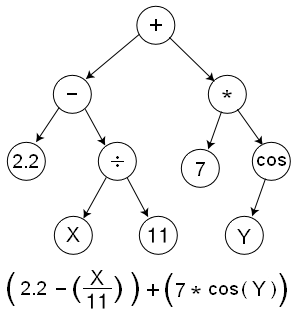
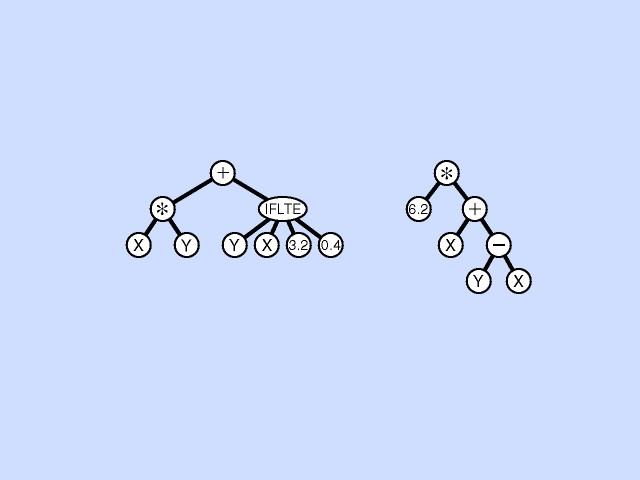
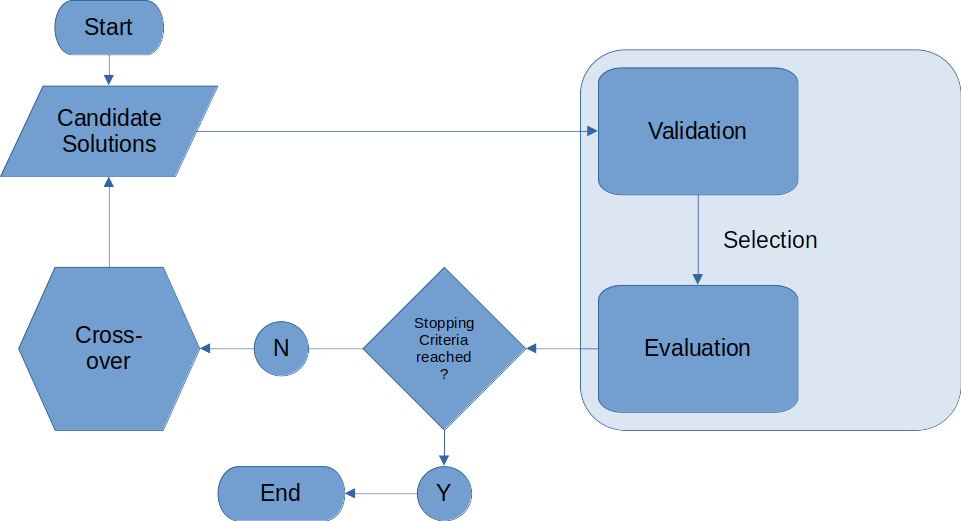
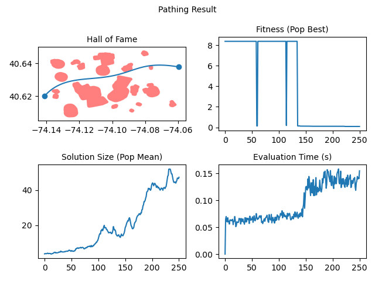
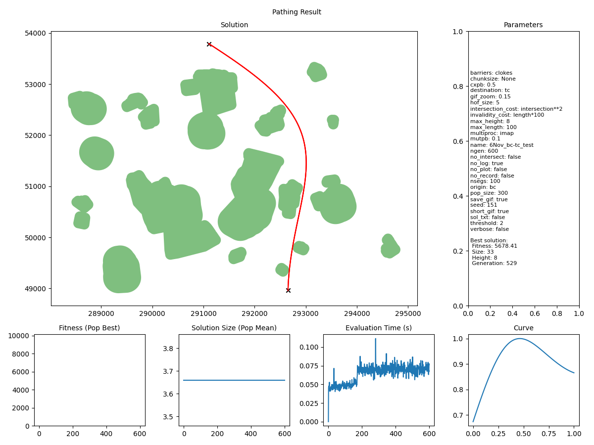

# Genetic programming to optimize 3D trajectories

> **_STATUS:_**  Working.

 Finding the optimal trajectory in a 3D space is an ongoing research topic with applications such as optimizing an underwater route for a submarine robot or a flight route for drones. The problem becomes challenging as soon as the 3D space has barriers like danger zones or protected spaces. Those barriers can be modelled as features in GIS. A research gap to be closed is to combine the trajectory optimization techniques with GIS-modelled 3D barriers. Namely, the produced 3D-routes from the optimization techniques need a validation process to ensure that no barriers are crossed. Since many validations are necessary, one requirement is a fast computation.

The aim of this thesis is to solve the trajectory optimization problem with the artificial intelligence technique called "Genetic Programming" (GP). The produced trajectories are to be converted into geographical lines, which are tested for any interference with GIS-modelled 3D barriers.

Based on Hildemann (2020) [3D-Flight-Route-Optimization](https://github.com/mohildemann/3D-Flight-Route-Optimization)

## How to use

0. Install all required packages (tested in Python 3.10 and 3.11)
1. Update configuration in `cfg/default.yml`
2. Pass additional arguments via command line (optional)
3. Provide/check test data in `data/test_data_2d.py` and `data/test_data_3d.py`
4. run `main.py`

## Contents

- [Trajectory Optimisation](#trajectory-optimisation)
- [Study Area](#study-area)
- [Genetic Programming](#genetic-programming)
- [Methodology](#methodology)
  - [Parameters](#parameters)
- [Solution Anatomy](#solution-anatomy)
- [Solution Transformation](#solution-transformation)
- [Solution Validation](#solution-validation)
- [The Cost Function](#the-cost-function)
- [Elitism](#elitism)
- [2-Dimensional Results](#2-dimensional-results)

## Trajectory Optimisation

## Study Area

From [CityOfNewYork/nyc-geo-metadata](https://github.com/CityOfNewYork/nyc-geo-metadata)

## Genetic Programming

Using [Distributed Evolutionary Algorithms in Python](https://github.com/DEAP/deap)

## Methodology

### Parameters

| Parameter | Type | Description |
| ----------- | ----------- | ----------- |
| barriers | `str` | geofences dataset |
| origin | `str` | start point |
| destination | `str` | end point |
| only_2d | `Bool` | ignore z-dimension completely |
| no_log | `Bool` | don't save GP log |
| no_record | `Bool` | don't record results to table |
| verbose | `Bool` | output progress to console |
| no_plot | `Bool` | don't save results png |
| save_gif | `Bool` | save results gif |
| short_gif | `Bool` | only show stepwise improvement in gif |
| map_zoom | `float` | zoom level for solution map |
| sol_txt | `Bool` | save solution as txt |
| threshold | `float` | max fitness to plot (factor of direct distance) |
| no_intersect | `Bool` | invalidate any intersecting lines |
| validation_3d | `str` | 3D validation method to use
| invalidity_cost | `exp` | penalty for intersection with `no_intersect=True` |
| intersection_cost | `exp` | penalty for intersection with `no_intersect=False` |
| ngen | `int` | number of generations to evolve through |
| nsegs | `int` | number of line vertices to use in solution validation |
| pop_size | `int` | population size to use in GP |
| cxpb | `float` | probability of two individuals reproducing |
| mutpb | `float` | probability of an individual mutating |
| max_height | `int` | height limit for function trees |
| max_length | `int` | length limit for function trees |
| elitism | `Bool` | implement elitism |
| patience | `int` | number of generations to wait for improvement |
| hof_size | `int` | number of individuals to save in HallOfFame |
| seed | `int` | random seed |
| multiproc | `imap`,`map`,`None` | multiprocessing to use |
| chunksize | `int` or `None` | chunksize parameter for multiprocessing |

## Solution Anatomy

## Solution Transformation

## Solution Validation

2-D validation is a simple intersection check using `shapely`

3-D intersection method can be specified in `cfg`:

| Method Name | Description |
| ----------- | ----------- |
| `delaunay` | Uses `scipy.spatial.Delaunay.find_simplex` to check if line vertices plot within simplices |
| `shapely` | Uses `shapely` `intersection()`,then checks if the intersecting geometry lies within a min-max `z` range |
| `hulls_equal` | Uses `scipy.spatial.ConvexHull` to compare hulls with and without line vertices |
| `linprog` | Uses `scipy.spatial.ConvexHull` and simplex linprog |
| `triangles` | Uses the [Möller–Trumbore](https://www.tandfonline.com/doi/abs/10.1080/10867651.1997.10487468) algorithm to find intersections of lines and triangulated meshes |

## The Cost Function

At present, validation is dependent on non-intersection with barriers, and fitness is a single value: the length of the path.

To be considered later:

1. Path variation in z-dimension (less=better)
2. Solution size (smaller=better)
3. Solution evolve-time (earlier=better)

## Elitism

Elitism can be activated via the `elitism` parameter.
The number of elite individuals injected into the subsequent generation is determined by the HallOfFame size.

## 2-Dimensional Results

250 generations for optimising the path through Clove Lakes subset:

Visualising the evolution:

### ToDo

- implement 3D
  - gp individuals need to be sets of trees
  - tree pairs to be evaluated in tandem
- plot 3D
- implement stop criteria
- fix 3D rotation matrices in doc
- implement chunksize
- improved error handling

### Done

- transform function into 2D line and map onto 2D interval
- transform function into 3D line and map onto 3D interval
- auto-fill results/tests table
- gracefully accept KeyboardInterrupt exception during multiprocessing
- load default config and update with passed args
- plot solution map and metrics
- implement elitism
- fix 2D rotation matrix in gptrajec.py
- multiprocessing enablable
- add params: tournsize, init_min, init_max

### Didn't work

- imap_unordered doesn't work, unless Ind ID is passed back and forth
- (n+1)D matrices for n-D transformations. They work, but are unnecessary (apparently)
