# Genetic programming to optimize 3D trajectories

> **_STATUS:_**  Working.

 Finding the optimal trajectory in a 3D space is an ongoing research topic with applications such as optimizing an underwater route for a submarine robot or a flight route for drones. The problem becomes challenging as soon as the 3D space has barriers like danger zones or protected spaces. Those barriers can be modelled as features in GIS. A research gap to be closed is to combine the trajectory optimization techniques with GIS-modelled 3D barriers. Namely, the produced 3D-routes from the optimization techniques need a validation process to ensure that no barriers are crossed. Since many validations are necessary, one requirement is a fast computation.

The aim of this thesis is to solve the trajectory optimization problem with the artificial intelligence technique called "Genetic Programming" (GP). The produced trajectories are to be converted into geographical lines, which are tested for any interference with GIS-modelled 3D barriers.

Based on Hildemann (2020) and Hildemann & Verstegen (2023) [3D-Flight-Route-Optimization](https://github.com/mohildemann/3D-Flight-Route-Optimization)

## How to use

0. Install all required packages (tested in Python 3.10 and 3.11)
1. Update configuration in `cfg/default.yml`
2. Pass additional arguments via command line (optional)
3. Provide/check test data in `data/test_data_2d.py` and `data/test_data_3d.py`
4. run `main.py`

## Contents

- [Trajectory Optimisation](#trajectory-optimisation)
- [Study Area](#study-area)
- [Genetic Programming](#genetic-programming)
  - [Parameters](#parameters)
- [Solution Anatomy](#solution-anatomy)
- [Solution Transformation](#solution-transformation)
- [Solution Validation](#solution-validation)
- [The Cost Function](#the-cost-function)
- [Elitism](#elitism)
- [2-Dimensional Results](#2-dimensional-results)
- [3-Dimensional Results](#3-dimensional-results)

## Trajectory Optimisation

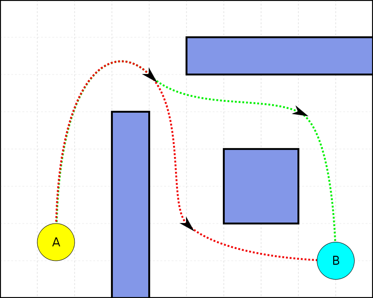

## Study Area

From [CityOfNewYork/nyc-geo-metadata](https://github.com/CityOfNewYork/nyc-geo-metadata)

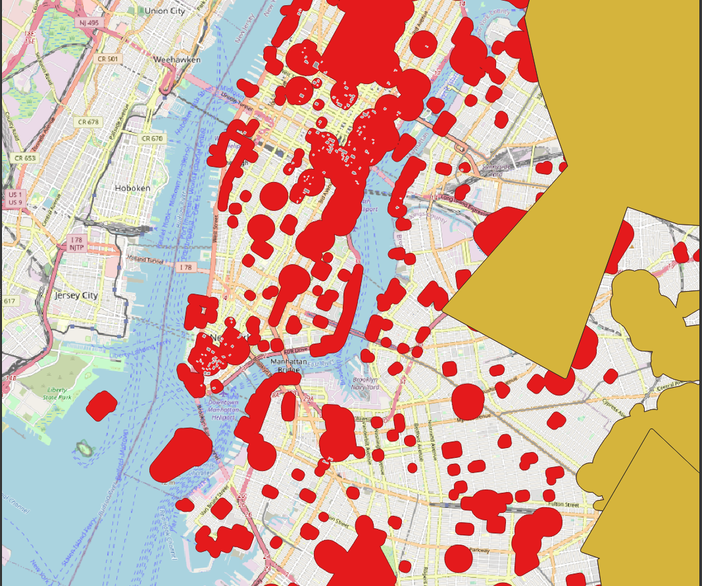

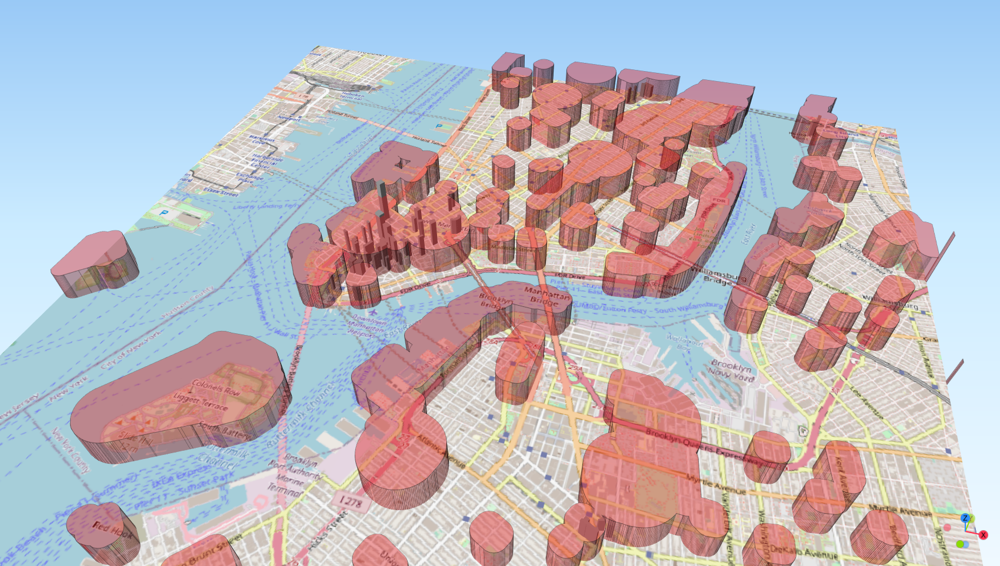

## Genetic Programming

Using [Distributed Evolutionary Algorithms in Python](https://github.com/DEAP/deap)

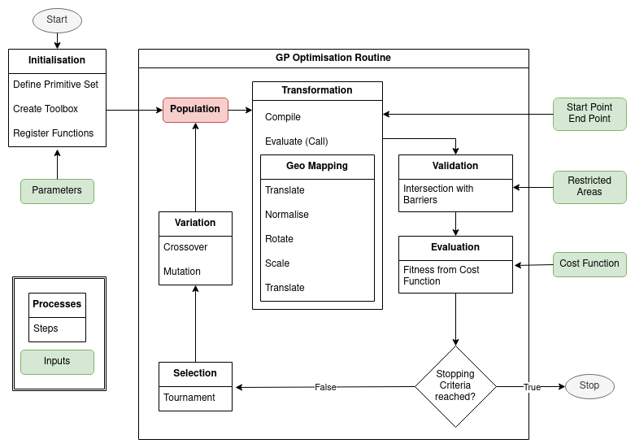

### Parameters

| Parameter | Type | Description |
| ----------- | ----------- | ----------- |
| barriers | `str` | geofences dataset |
| origin | `str` | start point |
| destination | `str` | end point |
| global_max |`float`| global upper height limit |
| global_min |`float`| global lower height limit |
| enable_3d | `Bool` | allow navigation in 3 dimensions |
| ngen | `int` | number of generations to evolve through |
| nsegs | `int` | number of line vertices to use in solution validation |
| pop_size | `int` | population size to use in GP |
| cxpb | `float` | probability of two individuals reproducing |
| mutpb | `float` | probability of an individual mutating |
| max_height | `int` | height limit for function trees |
| max_length | `int` | length limit for function trees |
| init_min | `int` | minimum height for new trees |
| init_max | `int` | maximum height for new trees |
| mut_min | `int` | minimum height for mutation subtree |
| mut_max | `int` | maximum height for mutation subtree |
| elitism | `Bool` | implement elitism |
| dbl_tourn | `Bool` | use double tournament selection |
| tournsize | `int` | number of individuals per tournament |
| parsimony_size | `float` | weight of size in double tournament |
| fitness_first | `Bool` | evaluate fitness first in double tournament |
| patience | `int` | number of generations to wait for improvement |
| hof_size | `int` | number of individuals to save in HallOfFame |
| seed | `int` | random seed |
| multiproc | `str` | multiprocessing to use |
| chunksize | `int` | chunksize parameter for multiprocessing |
| threshold | `float` | max fitness to plot (factor of direct distance) |
| adaptive_mode | `Bool` | quantitatively validate trajectories |
| validation_3d | `str` | 3D validation method to use |
| invalidity_cost | `exp` | penalty for intersection with `adaptive_mode=False` |
| intersection_cost | `exp` | penalty for intersection with `adaptive_mode=True` |
| delete_invalid | `Bool` | delete invalid solutions |
| no_log | `Bool` | don't save GP log |
| no_record | `Bool` | don't record results to table |
| verbose | `Bool` | output progress to console |
| no_plot | `Bool` | don't save results png |
| save_gif | `Bool` | save results gif |
| save_wkt | `Bool` | save result geometry as wkt |
| short_gif | `Bool` | only show stepwise improvement in gif |
| map_zoom | `float` | zoom level for solution map |
| sol_txt | `Bool` | save solution as txt |
| sol_png | `Bool` | save solution tree as png |

## Solution Anatomy

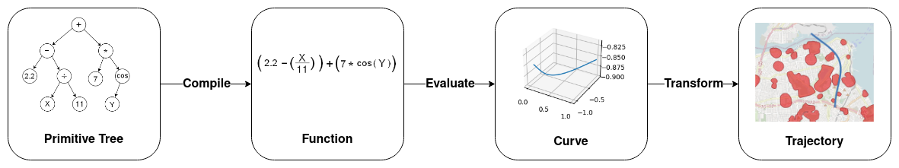

## Solution Transformation

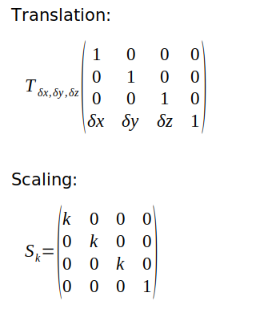

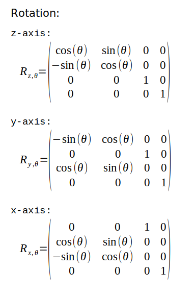

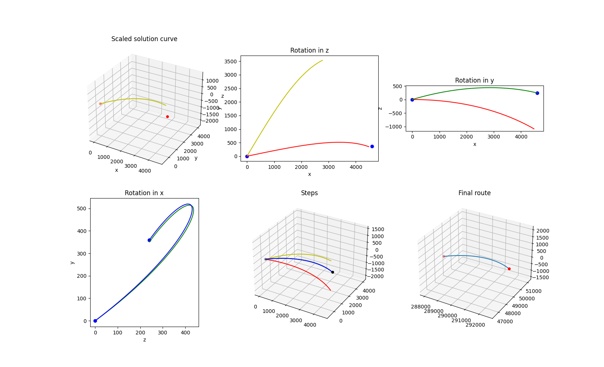

## Solution Validation

2-D validation is a simple intersection check using `shapely`

3-D intersection method can be specified in `cfg`:

| Method Name | Description |
| ----------- | ----------- |
| `delaunay` | Uses `scipy.spatial.Delaunay.find_simplex` to check if line vertices plot within simplices |
| `shapely` | Uses `shapely` `intersection()`,then checks if the intersecting geometry lies within a min-max `z` range |
| `hulls_equal` | Uses `scipy.spatial.ConvexHull` to compare hulls with and without line vertices |
| `linprog` | Uses `scipy.spatial.ConvexHull` and simplex linprog |
| `triangles` | Uses the [Möller–Trumbore](https://www.tandfonline.com/doi/abs/10.1080/10867651.1997.10487468) algorithm to find intersections of lines and triangulated meshes |

## The Cost Function

Validation is dependent on non-intersection with barriers. Fitness is dependent on the length of the path and the solution size.

Also considered:

1. Path variation in z-dimension (less=better)
2. Solution evolve-time (earlier=better)

## Elitism

Elitism can be activated via the `elitism` parameter.
The number of elite individuals injected into the subsequent generation is determined by the HallOfFame size and is recommendeed to be 5-10% of the pop_size.

## 2-Dimensional Results

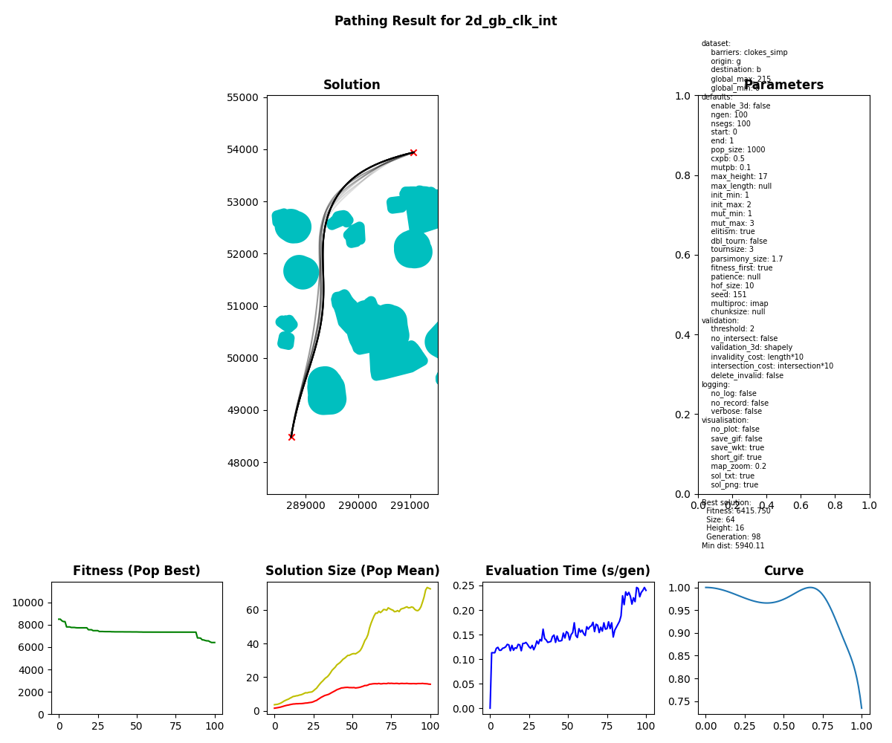

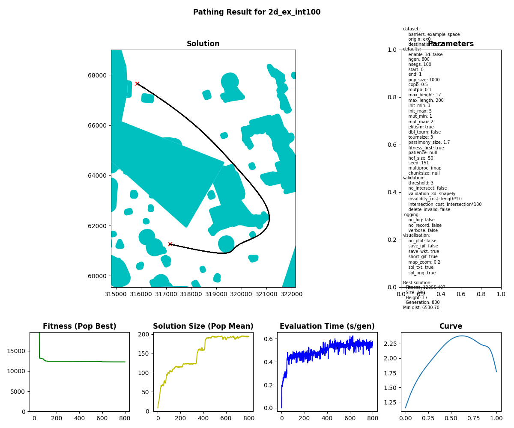

Visualising the evolution:

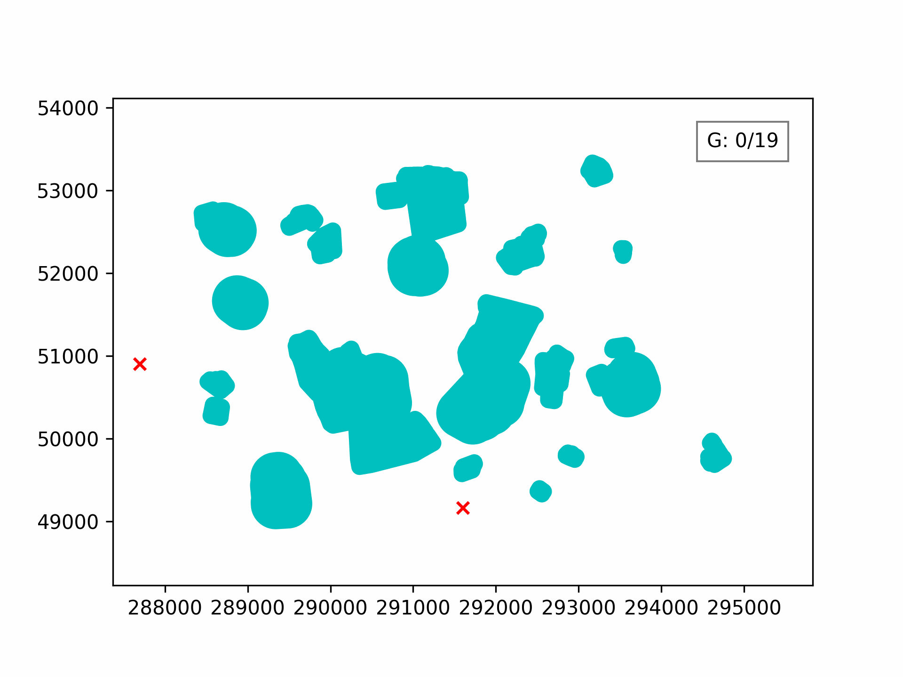

## 3-Dimensional Results

100 generations for optimising the 3D path through Clove Lakes subset:

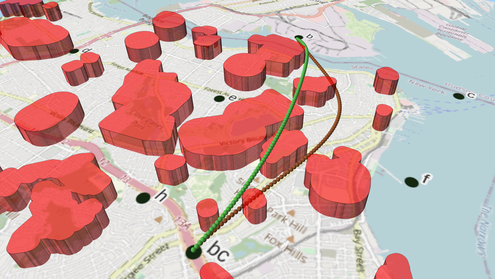

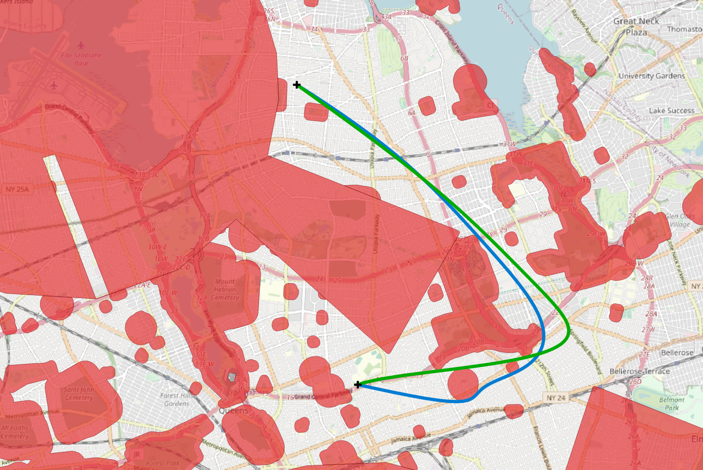

### Done

- transform function into 2D line and map onto 2D interval
- transform function into 3D line and map onto 3D interval
- auto-fill results/tests table
- gracefully accept KeyboardInterrupt exception during multiprocessing
- load default config and update with passed args
- plot solution map and metrics
- implement elitism
- fix 2D rotation matrix in gptrajec.py
- multiprocessing enablable and chunksize passable
- add params: tournsize, init_min, init_max
- implement 2.5D
- basic plot 3D

### Didn't work

- imap_unordered doesn't work, unless Ind ID is passed back and forth
- (n+1)D matrices for n-D transformations. They work, but are unnecessary
